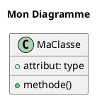

# 📊 **DIAGRAMMES DE CONCEPTION - Gestion des Crédits**

## 🎯 **Vue d'ensemble des diagrammes**

Ce dossier contient les diagrammes de conception UML pour votre système de gestion des crédits, créés avec **PlantUML**.

## 📁 **Fichiers disponibles**

### **1. Diagramme de Séquence** - `diagramme_sequence_credits.puml`
- **Objectif :** Montrer le flux d'interaction entre composants
- **Contenu :** Interactions utilisateur → navigateur → Django → base de données
- **Cas d'usage :** Comprendre le flux de données et les appels système

### **2. Diagramme de Classe** - `diagramme_classe_credits.puml`
- **Objectif :** Représenter la structure des modèles et leurs relations
- **Contenu :** Classes, attributs, méthodes et associations
- **Cas d'usage :** Architecture du système et relations entre entités

### **3. Diagramme d'Activité** - `diagramme_activite_credits.puml`
- **Objectif :** Décrire le flux de travail et les processus métier
- **Contenu :** Étapes, décisions et flux de contrôle
- **Cas d'usage :** Processus métier et logique applicative

## 🚀 **Comment visualiser les diagrammes**

### **Option 1 : PlantUML Online (Recommandé)**
1. Allez sur [PlantUML Online](http://www.plantuml.com/plantuml/uml/)
2. Copiez le contenu d'un fichier `.puml`
3. Collez dans l'éditeur
4. Le diagramme se génère automatiquement

### **Option 2 : Extension VS Code**
1. Installez l'extension "PlantUML" dans VS Code
2. Ouvrez un fichier `.puml`
3. Utilisez `Ctrl+Shift+P` → "PlantUML: Preview Current Diagram"

### **Option 3 : Plugin IntelliJ/WebStorm**
1. Installez le plugin "PlantUML integration"
2. Ouvrez un fichier `.puml`
3. Le diagramme se prévisualise automatiquement

## 🔍 **Détail des diagrammes**

### **Diagramme de Séquence**
```
Utilisateur → Navigateur → Django Views → Models → Base de Données
     ↓
Templates ← Views ← Models ← Base de Données
     ↓
Navigateur → Utilisateur
```

**Phases principales :**
1. **Accès à la page** - Navigation et authentification
2. **Affichage des statistiques** - Calculs et agrégations
3. **Filtrage et recherche** - Traitement des paramètres
4. **Gestion des sections** - Affichage conditionnel
5. **Actions sur crédits** - CRUD complet
6. **Pagination** - Navigation entre pages

### **Diagramme de Classe**
**Modèles principaux :**
- **User** - Utilisateurs du système
- **Client** - Clients bénéficiaires
- **Credit** - Crédits accordés
- **Echeance** - Échéances de paiement
- **Cheque** - Chèques de garantie
- **Alerte** - Notifications système
- **ActionLog** - Historique des actions

**Relations clés :**
- `Client` → `Credit` (1:N)
- `Credit` → `Echeance` (1:N)
- `Echeance` → `Cheque` (1:1)
- `User` → `ActionLog` (1:N)

### **Diagramme d'Activité**
**Flux principal :**
1. **Authentification** - Vérification des droits
2. **Dashboard** - Affichage des statistiques
3. **Gestion des crédits** - CRUD complet
4. **Gestion des clients** - Administration
5. **Gestion des échéances** - Suivi des paiements
6. **Historique** - Traçabilité des actions

## 💡 **Utilisation pratique**

### **Pour les développeurs :**
- **Comprendre l'architecture** du système
- **Identifier les dépendances** entre composants
- **Planifier les modifications** et évolutions
- **Documenter le code** existant

### **Pour les utilisateurs :**
- **Comprendre le processus** métier
- **Identifier les étapes** de travail
- **Formaliser les procédures** d'utilisation

### **Pour la maintenance :**
- **Localiser les problèmes** rapidement
- **Planifier les évolutions** en toute sécurité
- **Former de nouveaux** développeurs

## 🛠️ **Modification des diagrammes**

### **Éditer un diagramme :**
1. Modifiez le fichier `.puml` correspondant
2. Utilisez la syntaxe PlantUML
3. Testez la génération
4. Mettez à jour la documentation

### **Syntaxe PlantUML :**


## 📚 **Ressources supplémentaires**

- **Documentation PlantUML :** [plantuml.com](http://plantuml.com/)
- **Guide UML :** [uml.org](https://www.uml.org/)
- **Tutoriels Django :** [docs.djangoproject.com](https://docs.djangoproject.com/)

## 🎉 **Avantages de cette approche**

1. **Documentation vivante** - Les diagrammes évoluent avec le code
2. **Communication claire** - Visualisation des concepts complexes
3. **Maintenance facilitée** - Compréhension rapide du système
4. **Formation efficace** - Support visuel pour l'apprentissage
5. **Évolution contrôlée** - Impact des modifications visible

---

**🔧 Ces diagrammes constituent la base de la documentation technique de votre système de gestion des crédits.**
